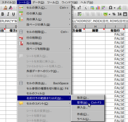
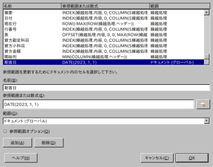

<!--
	「Calc会計帳」の日本語マニュアル。

	Metadata:

		author - <qq542vev at https://purl.org/meta/me/>
		version - 0.0.1
		date - 2023-03-04
		since - 2021-03-04
		copyright - Copyright (C) 2023-2023 qq542vev. Some rights reserved.
		license - <CC-BY at https://creativecommons.org/licenses/by/4.0/>
		package - calc-kaikeicho

	See Also:

		* <Project homepage at https://github.com/qq542vev/calc-kaikeicho>
		* <Bug report at https://github.com/qq542vev/calc-kaikeicho/issues>
-->

# Calc会計帳

Calc会計帳は [LibreOffice Calc](https://ja.libreoffice.org/discover/calc/) で動作する小規模個人事業向けの無料会計ソフトウェアです。

# 特徴

全ての機能を無料でご利用いただけます。また[ライセンス](LICENSE)の条件の基で、自由に改変、再頒布が行えます。

個人事業会計の仕訳で使用すると思われる、400個程度の勘定科目を事前に定義してあります。また仕訳帳の小科目を利用することで勘定科目よりも細かい分類が可能です。

期首日、期末日を自由に変更できます。1月1日から12月31日の1年間だけではなく、100日、6ヶ月、2年なども設定可能です。

全てのコンピュータで検証したわけではありませんが、LibreOffice Calc が動作するコンピュータであれば CPU や OS の違いに関わらず、大方問題なくご利用いただけると思います。

表計算のマクロ機能やピボットテーブル、その他の拡張機能などは利用しておりません。主要な機能は表計算の関数のみを用いて造られています。

外部(例えばインターネットなど)と通信する機能は利用していません。そのためコンピューターが完全なオフライン環境でも動作します。

他のファイルを参照する機能は利用していません。勘定科目のデータベースなどはファイル内の別シートに収められています。そのため複数のファイルを管理する必要はありません。1つの表計算ファイルのみで動作します。

仕訳帳に入力することで、以下の帳表が自動的に作成されます。

 * 総勘定元帳
 * 損益計算書(報告式 / 勘定式)
 * 貸借対照表(報告式 / 勘定式)
 * 推移表(月次 / 週次 / 日次)
   * 損益計算書(小計 / 累計)
   * 貸借対照表(小計 / 累計)

# 確定申告について

Calc会計帳は会計のためのソフトウェアであり、税務である確定申告に完全対応している訳ではないですが、確定申告に利用することも可能です。青色申告では売掛帳、買掛帳、固定資産台帳、現金出納帳、経費帳の記帳を求められています。

現金出納帳、経費帳は総勘定元帳から作成可能です。仕訳帳の小科目と総勘定元帳を組み合わせて利用することで、簡易的な売掛帳、買掛帳、預金出納帳として利用することも可能です。預金口座による資金移動や売掛金や買掛金が生じた場合は、小科目に取引相手を記入してください。固定資産台帳については各自で用意してください。

また勘定科目には確定申告で利用する「事業主借」、「事業主貸」、「元入金」、「専従者給与」が事前に定義されています。

# 利用方法

[最新バージョンのCalc会計帳](https://github.com/qq542vev/calc-kaikeicho/releases/latest)をダウンロードして、LibreOffice Calc で開きます。メニューバーの「シート」>>「名前付きの範囲または式」>>「管理」を選択します。名前の中から「期首日」と「期末日」を探しだし、日付となる値を変更します。

 

## 初めて記帳を行う場合

仕訳帳に資産と負債を入力していきます。日付は設定した期首日と同一日であり、また相手勘定科目は「元入金」である必要があります。

仕訳帳に仕訳内容を記帳して行きます。(列幅は各自で調整してください。小科目が不要の場合は列を非表示にしてください。)それに伴って各種帳表が自動的に作成されます。

## 前期の残高を繰越処理する

前記会計ファイルの「繰越処理」シート内の勘定科目と金額をコピーし、今期会計ファイルの仕訳帳の先頭に貼り付けます。

## 総勘定元帳について

総勘定元帳は技術的な制限から、1つのページに250件までしか表示できません。デフォルトでは「現金」の1ページ目を表示します。勘定科目と小科目とページ数を変更することにより、表示内容が変化します。

## 推移表について

技術的な制限により、12期間しか表示できません。デフォルトでは1ページ目の月次推移が表示されます。期間(月次 / 週次 / 月次)、計(小計 / 累計)、ページ数を変更することにより、表示内容が変化します。

# 動作確認

Calc会計長は以下のコンピューター環境で動作を確認しています。

~~~
バージョン: 6.2.8.2
Build ID: f82ddfca21ebc1e222a662a32b25c0c9d20169ee
CPU threads: 1; OS:Linux 3.2; UI render: default; VCL: gtk2; 
ロケール: ja-JP (ja_JP.UTF-8); UIの言語: ja-JP
Calc: threaded
~~~
